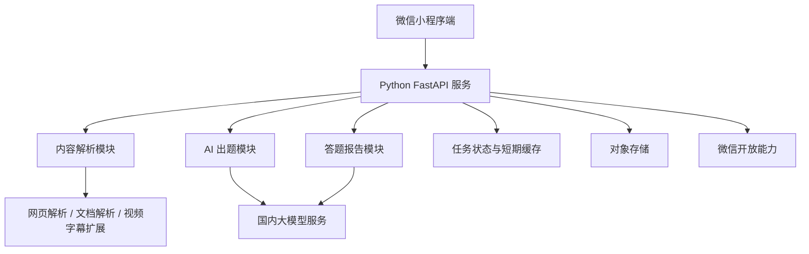
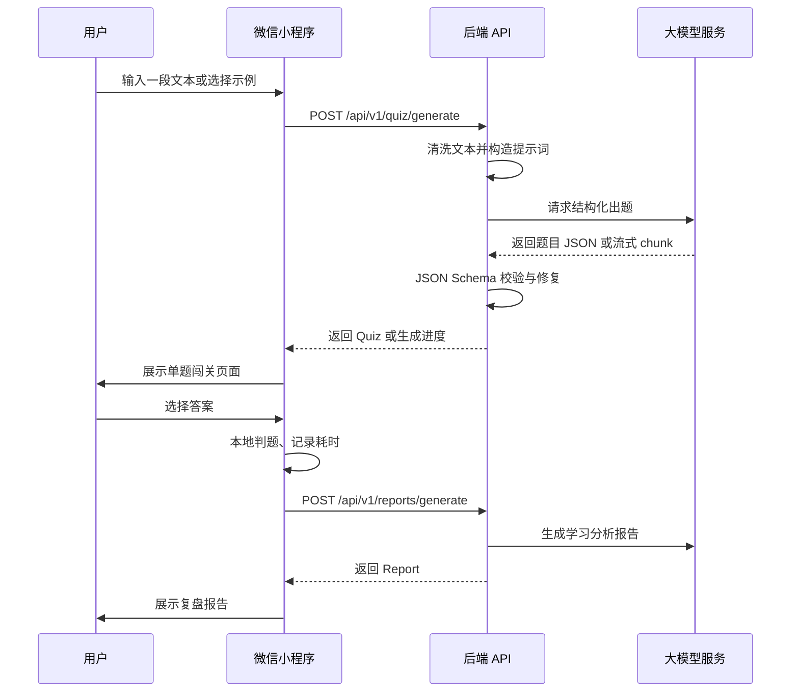

# 《智能微学习 AI 互动闯关小程序》方案设计文档

> 文档版本：v1.0  
> 编写日期：2026-05-31  
> 依据材料：`需求文档.md`、`需求文档1.md`、`需求文档2.md`  
> 核心原则：微信优先、国内合规、先跑通最小业务闭环。

---

## 1. 项目概述

### 1.1 产品定位

本项目是一款基于微信小程序生态的“多模态个人知识提取器与游戏化闯关微学习工具”。它不以海量静态题库为核心竞争力，而是把用户当下接触到的碎片化知识内容快速转化为可互动、可反馈、可复盘的轻量测验。

产品主打场景是：用户输入或粘贴一段知识内容，小程序调用 AI 自动提炼知识点并生成题目，用户完成答题后获得即时解析和学习分析报告。

### 1.2 MVP 核心闭环

MVP 阶段只实现最小可验证闭环：

```text
用户输入内容 -> AI 生成题目 -> 用户答题 -> AI 生成分析报告
```

MVP 不优先实现以下功能：

- 用户注册登录、会员体系、虚拟支付。
- 长期数据库、完整个人中心、复杂错题本。
- B 站音频转写、公众号复杂反爬抓取、本地文件深度解析。
- RAG 私有知识库、多人 PK、排行榜、AI 数字人、AI 生图。

### 1.3 目标用户

- 碎片化学习用户：希望快速检测自己是否理解一段内容。
- 学生与考证用户：需要把知识点快速变成判断题、单选题进行自测。
- 职场新人和兴趣学习者：希望降低整理笔记、出题、复盘的时间成本。

### 1.4 MVP 成功标准

- 用户能在 1 分钟内从输入内容进入第一道题。
- 单次生成 3 到 5 道题，题目结构稳定、可答、可判分。
- 完成答题后能生成可读的知识总结、薄弱点和复习建议。
- iOS 与 Android 微信真机均能完成完整流程。
- 当流式响应不可用时，轮询降级仍能保证流程可用。

---

## 2. 技术选型

### 2.1 小程序端选型结论

推荐方案：**微信原生小程序 + TypeScript**。

推荐原因：

- 本项目第一阶段只面向微信生态，原生方案最贴近微信审核、分享、Canvas、小程序码、分包、网络请求等平台能力。
- AI 流式出题需要适配 `wx.request({ enableChunked: true })` 与 `RequestTask.onChunkReceived`，原生开发更容易排查真机差异。
- 独立开发者前期更需要降低框架抽象成本，先验证产品闭环，而不是先追求多端复用。
- 后续如果验证成功，可以再评估是否把业务组件抽象为 Taro 或 uni-app 版本。

### 2.2 小程序技术对比

| 维度 | 微信原生小程序 + TS | Taro | uni-app |
| --- | --- | --- | --- |
| MVP 推荐度 | 高，首选 | 中，备选 | 中，备选 |
| 适合团队 | 微信优先、独立开发者、追求低调试成本 | React 技术栈团队、未来多端复用 | Vue 技术栈团队、未来多端复用 |
| 微信能力适配 | 最直接，官方能力第一时间可用 | 依赖框架封装，复杂能力可能需要穿透原生 API | 依赖框架封装，部分平台差异需条件编译 |
| 流式响应调试 | 最直接使用 `wx.request` 与 `onChunkReceived` | 可调用 Taro request 或直接调用原生 API | 可通过 `uni.request` 或条件编译适配 |
| 组件生态 | 原生组件、Vant Weapp 等 | React 生态、Taro UI/Taroify | Vue 生态、uni-ui/uView 等 |
| 包体控制 | 直接使用分包、独立分包、预下载 | 框架运行时代码增加一定包体 | 框架运行时代码增加一定包体 |
| 后续多端 | 弱 | 强 | 强 |
| 主要风险 | UI 工程化能力比跨端框架弱 | 框架抽象与微信真机问题叠加 | 条件编译与平台差异增加维护成本 |

最终决策：

- **MVP 使用微信原生小程序 + TypeScript。**
- 若后续明确需要 H5、App、支付宝/抖音小程序，再评估 Taro 或 uni-app 重构。
- 若未来团队以 React 为主，优先评估 Taro；若团队以 Vue 为主，优先评估 uni-app。

### 2.3 后端选型

MVP 实际采用方案：**Python FastAPI + Pydantic + OpenAI-compatible Model Adapter**。

推荐原因：

- FastAPI 适合快速构建轻量 HTTP API，接口定义清晰，便于小程序端联调。
- Pydantic 能对模型输出的 Quiz、Question、Report 做强结构校验，适合 AI JSON 输出场景。
- Python 生态更便于后续扩展内容解析、文档处理、RAG、向量检索和模型编排能力。
- 通过 OpenAI-compatible Adapter 接入 DeepSeek 等国内模型，后续可继续扩展通义千问、豆包、混元等服务商。
- 本地开发可使用 mock adapter 跑通闭环，真实模型接入通过 `.env` 控制，不向小程序端暴露 API Key。

部署建议：

- MVP 本地开发：`uvicorn` 启动 FastAPI 服务，小程序请求 `http://127.0.0.1:8000`。
- 体验版/正式版：将 FastAPI 部署到支持 HTTPS 的国内云服务或腾讯云 CloudBase 云托管，并在微信公众平台配置 request 合法域名。
- CloudBase 云函数、云数据库、云存储仍作为后续登录、历史记录、小程序码、文件解析和对象存储能力的候选方案，不作为 M0 的必要前提。

MVP 后端保持轻量：

- 不引入复杂微服务。
- 不强制登录。
- 不建立长期用户数据库。
- 只保留必要的短期任务状态、日志和生成结果缓存。

### 2.4 AI 服务选型

推荐方案：**国内模型优先 + 后端统一 Model Adapter**。

首选方向：

- 腾讯云 CloudBase AI / 混元生态。
- 保留通义千问、豆包、DeepSeek 国内服务商适配口。
- 如后续需要更强推理能力，可通过 Adapter 扩展其他模型，但必须经过合规评估。

关键要求：

- 模型不得直接面向小程序端暴露 API Key。
- 出题必须走后端封装，统一做提示词、结构化校验、重试、日志脱敏。
- 所有题目输出必须经过 JSON Schema 校验，不能直接信任模型自然语言输出。
- 当模型返回脏 JSON、字段缺失、答案不在选项中时，后端需要自动修复或重试。

### 2.5 流式响应选型

小程序端不直接依赖浏览器标准 `EventSource`。MVP 推荐：

- 主路径：`wx.request({ enableChunked: true })` + `RequestTask.onChunkReceived`。
- 降级路径：后端返回 `jobId`，小程序轮询 `GET /api/v1/jobs/{jobId}`。

原因：

- 微信小程序官方 `wx.request` 支持 `enableChunked`，`RequestTask.onChunkReceived` 可监听 chunk。
- 真机环境、基础库版本、Android/iOS 表现可能存在差异，必须预留轮询降级。
- 对用户体验而言，MVP 的核心不是“必须逐字输出”，而是“等待可感知、流程不中断”。

---

## 3. 总体架构

### 3.1 架构分层



### 3.2 模块职责

| 模块 | 主要职责 | MVP 范围 |
| --- | --- | --- |
| 小程序端 | 输入、生成进度展示、答题交互、报告展示、分享入口 | 必做 |
| API 网关 | 鉴权占位、参数校验、限流、路由、错误格式统一 | 必做 |
| 内容解析模块 | 将用户输入传递给出题模块，并做基础保护 | MVP 只做首尾空白处理、长度保护和短主题/长内容模式判断 |
| AI 出题模块 | 调用模型生成结构化题目 | 必做 |
| 答题报告模块 | 根据题目、答案、耗时生成分析报告 | 必做 |
| 任务状态模块 | 支持流式失败后的轮询降级 | 必做 |
| 对象存储 | 存储后续文件、海报、截图等资源 | MVP 可只预留 |
| 微信开放能力 | 分享、小程序码、虚拟支付、登录 | MVP 只做分享占位 |

### 3.3 部署建议

MVP 推荐采用单后端服务：

```text
miniprogram/
  原生微信小程序

backend/
  Python FastAPI API 服务
  app/
    main.py
    schemas.py
    adapters/
      base.py
      deepseek.py
      mock.py
    services/
      text_normalizer.py
      quiz_service.py
      report_service.py
  tests/
```

部署方式：

- 小程序端：微信开发者工具上传体验版、审核版。
- 后端服务：FastAPI 部署到支持 HTTPS 的国内云服务，优先保证微信 request 合法域名可配置。
- 临时缓存：M0 使用本地/内存和小程序本地缓存；多实例部署前再切换为云数据库或 Redis 兼容服务。
- 对象存储：MVP 暂不强依赖，后续文件解析、海报、小程序码可使用 CloudBase 云存储或腾讯云 COS。

---

## 4. 核心业务流程设计

### 4.1 MVP 流程



### 4.2 内容输入

MVP 支持：

- 首页示例模板。
- 用户自由输入一句话或一段长文本。
- 粘贴文本内容。

MVP 暂不强依赖：

- 公众号链接抓取。
- B 站视频解析。
- PDF/Doc/图片上传。
- 全网搜索。

后续扩展顺序：

1. 普通网页链接解析。
2. 微信公众号文章解析。
3. B 站字幕解析。
4. PDF/Doc 文档解析。
5. 图片 OCR。

### 4.3 内容解析

MVP 解析策略：

- 对纯文本做长度校验、空白清洗、明显广告/无效字符过滤。
- 对超长文本做截断或分段摘要，避免模型上下文超限。
- 生成一个 `NormalizedSource`，供出题模块消费。

建议结构：

```ts
interface NormalizedSource {
  sourceType: 'demo' | 'text' | 'url' | 'file';
  title?: string;
  content: string;
  language: 'zh-CN' | 'en' | 'unknown';
  length: number;
  warnings: string[];
}
```

后续解析策略：

- 网页：优先通用正文提取，再补充 Headless Chrome 渲染。
- 公众号：优先合规可访问内容，不在 MVP 中投入复杂反爬。
- B 站：优先字幕，不优先音频转写。
- 文件：先接入 PDF/Doc 文本抽取，再做图片 OCR。

### 4.4 AI 出题

出题配置：

- 题量：3 题或 5 题。
- 题型：单选题、判断题。
- 难度：简单、标准、进阶，MVP 默认标准。

提示词要求：

- 题目必须基于输入内容，不允许编造输入中没有的事实。
- 单选题必须包含 4 个选项。
- 判断题必须包含“正确/错误”两个选项。
- 每题必须提供标准答案、解释、考点追溯。
- 输出必须符合后端定义的 JSON Schema。

后端校验规则：

- `questions.length` 必须等于请求题量。
- 每题 `stem` 不为空。
- 每题 `options` 不为空。
- `answer` 必须命中某个选项 ID。
- `explanation` 不为空。
- `sourceTrace` 尽量引用原文片段，不得超过合理长度。

失败处理：

- 第一次校验失败：调用模型修复 JSON。
- 第二次仍失败：退化为普通 JSON 生成。
- 仍失败：返回清晰错误，让前端展示“生成失败，可减少文本长度后重试”。

### 4.5 互动答题

小程序端负责：

- 单题卡片展示。
- 进度条。
- 选项点击态。
- 本地即时判题。
- 正确答案高亮。
- 解释内容展示。
- 答题耗时记录。

MVP 交互建议：

- 每次只展示一道题，降低认知负担。
- 用户提交后立即展示正误和解析。
- 下一题按钮明确，不自动跳转，避免用户错过解析。
- 动效控制在轻量范围，避免影响小程序性能。

### 4.6 分析报告

报告输入：

- 题目列表。
- 用户答案。
- 每题耗时。
- 总耗时。
- 原始内容摘要。

报告输出：

- 本次正确率。
- 知识掌握概览。
- 易错点。
- 关键知识结构。
- 下一步复习建议。
- 一句适合分享的学习成就文案。

MVP 可以由后端调用 AI 生成报告，但基础统计必须由程序计算：

- `score`
- `accuracy`
- `correctCount`
- `wrongCount`
- `duration`

---

## 5. 接口设计

### 5.1 通用响应格式

```ts
interface ApiResponse<T> {
  success: boolean;
  data?: T;
  error?: {
    code: string;
    message: string;
    detail?: unknown;
  };
  requestId: string;
}
```

### 5.2 生成题目

`POST /api/v1/quiz/generate`

请求：

```ts
interface GenerateQuizRequest {
  sourceType: 'demo' | 'text' | 'url' | 'file';
  content: string;
  questionCount: 3 | 5;
  questionTypes: Array<'single_choice' | 'true_false'>;
  difficulty: 'easy' | 'normal' | 'hard';
  stream?: boolean;
}
```

普通响应：

```ts
interface GenerateQuizResponse {
  quiz: Quiz;
}
```

流式响应事件建议：

```json
{ "type": "progress", "message": "正在提炼知识点" }
{ "type": "question", "data": { "...": "Question" } }
{ "type": "done", "data": { "...": "Quiz" } }
{ "type": "error", "error": { "code": "MODEL_OUTPUT_INVALID", "message": "题目生成失败" } }
```

### 5.3 查询任务

`GET /api/v1/jobs/{jobId}`

用途：

- 当小程序端 chunk 流式不可用时，使用轮询降级。
- 当内容解析或 AI 生成超过常规请求时间时，查询任务状态。

响应：

```ts
interface JobStatusResponse {
  jobId: string;
  status: 'queued' | 'running' | 'succeeded' | 'failed';
  progress: number;
  message?: string;
  result?: Quiz | Report;
  error?: {
    code: string;
    message: string;
  };
}
```

### 5.4 生成报告

`POST /api/v1/reports/generate`

请求：

```ts
interface GenerateReportRequest {
  quizId: string;
  questions: Question[];
  answers: AnswerRecord[];
  duration: number;
}
```

响应：

```ts
interface GenerateReportResponse {
  report: Report;
}
```

---

## 6. 核心数据结构

### 6.1 Quiz

```ts
interface Quiz {
  quizId: string;
  title: string;
  summary: string;
  sourceType: 'demo' | 'text' | 'url' | 'file';
  questionCount: number;
  questions: Question[];
  createdAt: string;
}
```

### 6.2 Question

```ts
interface Question {
  id: string;
  type: 'single_choice' | 'true_false';
  stem: string;
  options: Array<{
    id: string;
    text: string;
  }>;
  answer: string;
  explanation: string;
  sourceTrace?: string;
  difficulty: 'easy' | 'normal' | 'hard';
}
```

### 6.3 AnswerRecord

```ts
interface AnswerRecord {
  questionId: string;
  selectedOption: string;
  isCorrect: boolean;
  duration: number;
}
```

### 6.4 Report

```ts
interface Report {
  reportId: string;
  quizId: string;
  score: number;
  accuracy: number;
  correctCount: number;
  wrongCount: number;
  duration: number;
  weakPoints: string[];
  knowledgeMap: Array<{
    topic: string;
    mastery: 'good' | 'normal' | 'weak';
  }>;
  reviewAdvice: string;
  shareText: string;
  createdAt: string;
}
```

---

## 7. 小程序端设计

### 7.1 页面结构

MVP 页面：

```text
pages/index/index          首页与内容输入
pages/generating/index     生成中状态页
pages/quiz/index           闯关答题页
pages/report/index         复盘报告页
```

后续页面：

```text
pages/history/index        本地历史记录
pages/mine/index           个人中心
pages/settings/index       设置与缓存清理
```

### 7.2 首页

核心组件：

- 示例模板列表。
- 文本输入框。
- 题量选择。
- 题型选择。
- 生成按钮。

默认配置：

- 题量：3 题。
- 题型：单选题 + 判断题。
- 难度：标准。

### 7.3 生成中页面

展示内容：

- 当前生成阶段：提炼知识点、生成题目、校验题目。
- 已生成题目数量。
- 失败重试提示。
- 取消生成按钮。

技术策略：

- 优先监听 chunk。
- 超过 3 秒没有 chunk，则提示“正在生成中”。
- chunk 失败或连接中断后，切换为任务轮询。

### 7.4 答题页

交互规则：

- 用户选择答案前，不展示正确答案。
- 用户选择后立即判题。
- 展示正确答案、解释、考点追溯。
- 用户点击“下一题”进入下一题。
- 最后一题完成后进入报告页。

状态结构建议：

```ts
interface QuizPageState {
  quiz: Quiz;
  currentIndex: number;
  answers: AnswerRecord[];
  questionStartAt: number;
  hasSubmitted: boolean;
}
```

### 7.5 报告页

展示模块：

- 正确率。
- 答题耗时。
- 知识掌握评价。
- 易错点。
- 复习建议。
- 分享按钮。

MVP 分享：

- 先支持 `onShareAppMessage` 分享小程序路径。
- 海报生成延后到 M1。

---

## 8. 后端设计

### 8.1 模块划分

```text
backend/
  app/
    main.py                 FastAPI 入口、路由、统一响应
    schemas.py              Pydantic 数据结构与校验
    errors.py               业务错误定义
    config.py               环境变量配置
    adapters/
      base.py               模型适配器接口
      deepseek.py           DeepSeek OpenAI-compatible 接入
      mock.py               本地 mock 模型
      factory.py            根据环境变量选择模型服务
    services/
      text_normalizer.py    输入长度保护与模式判断
      quiz_service.py       出题编排、校验和兜底
      report_service.py     报告统计和生成编排
  tests/
    test_api_quiz.py
    test_api_report.py
    test_quiz_schema.py
    test_report_service.py
    test_text_normalizer.py
```

### 8.2 Model Adapter

目的：

- 隔离不同模型服务的 API 差异。
- 统一提示词、结构化输出、错误处理。
- 支持本地 mock，便于小程序端联调。

接口建议：

```py
class ModelAdapter(Protocol):
    def generate_quiz(self, source: NormalizedSource, request: GenerateQuizRequest) -> Quiz:
        ...

    def generate_report(
        self,
        quiz_id: str,
        questions: list[Question],
        answers: list[AnswerRecord],
        duration: int,
    ) -> Report:
        ...
```

### 8.3 任务状态

任务状态用于两类场景：

- 流式接口失败后的轮询降级。
- 后续链接解析、文件解析等长耗时任务。

MVP 存储策略：

- M0 暂不引入服务端长期任务表，生成结果主要保存在小程序本地缓存。
- 后续实现流式和轮询降级时，可先使用进程内 dict 存储短期任务状态。
- 部署到多实例前切换为云数据库或 Redis。
- 任务 TTL 默认 30 分钟。

### 8.4 日志与观测

必须记录：

- `requestId`
- 输入类型与长度，不记录完整用户原文。
- 模型服务商、模型名称。
- 生成耗时。
- 校验失败次数。
- 错误码。

不得记录：

- 用户完整敏感文本。
- 模型 API Key。
- 未脱敏的用户标识。

---

## 9. 开发流程与实施路线

### 9.1 M0：核心闭环验证

周期建议：1 到 2 周。

目标：

- 文本输入。
- AI 生成 3/5 道题。
- 小程序答题。
- 生成基础报告。

任务：

- 初始化微信原生小程序项目。
- 初始化 Python FastAPI 后端。
- 实现 `POST /api/v1/quiz/generate`。
- 实现 `POST /api/v1/reports/generate`。
- 使用 Pydantic 实现题目和报告结构校验。
- 实现小程序答题页和报告页。
- 使用 mock 模型服务保证前端先跑通。
- 接入 DeepSeek OpenAI-compatible API 做真实生成，并保留 mock 兜底。

验收：

- 输入短主题和 300 到 1000 字文本均能生成题目。
- 用户能完整答完并看到报告。
- 模型异常时有明确错误提示。

### 9.2 M1：体验增强与分享

周期建议：1 到 2 周。

目标：

- 提升等待体验。
- 增加微信分享。
- 增加本地历史记录。
- 增加基础海报。

任务：

- 实现 chunk 流式响应。
- 实现轮询降级。
- 实现 `onShareAppMessage`。
- 使用本地缓存保存最近生成记录。
- 增加基础 Canvas 海报或服务端图片生成。

验收：

- iOS 与 Android 真机均能生成题目。
- 流式失败时仍能通过轮询完成。
- 分享路径能打开对应页面或首页。

### 9.3 M2：内容解析扩展

周期建议：2 到 4 周。

目标：

- 支持网页链接解析。
- 支持公众号内容的可行解析策略。
- 支持 B 站字幕优先解析。
- 支持 PDF/Doc 文本抽取。

任务：

- 增加 `sourceType=url` 解析。
- 普通网页正文提取。
- 公众号链接解析可行性验证。
- B 站优先获取字幕，不优先做音频转写。
- 文档上传到对象存储后异步解析。

验收：

- 普通网页链接能稳定提取正文并出题。
- 解析失败时能提示用户改用复制正文。
- 长任务状态可查询。

### 9.4 M3：商业化与长期能力

周期建议：验证留存后再启动。

目标：

- 登录与用户体系。
- 数据库错题本。
- 会员和虚拟支付。
- RAG 私有知识库。
- 多人 PK 等游戏化能力。

任务：

- 接入微信登录并绑定 openid。
- 设计学习记录表、错题表、题库表。
- 接入微信虚拟支付。
- 引入向量数据库和文档切片。
- 引入 WebSocket 对战服务。

启动条件：

- MVP 有稳定自然分享或复访数据。
- 单次 AI 成本可控。
- 用户愿意为更长文本、更高题量或深度报告付费。

---

## 10. 测试方案

### 10.1 模型输出测试

测试点：

- JSON 可解析。
- 字段完整。
- 答案命中选项。
- 题干不为空。
- 解释不为空。
- 题目数量符合请求。

建议建立固定测试样本：

- 生活常识文本。
- 历史知识文本。
- 专业概念文本。
- 超短文本。
- 超长文本。
- 带噪声文本。

### 10.2 业务闭环测试

场景：

- 选择示例模板生成题目。
- 输入短文本生成 3 题。
- 输入长文本生成 5 题。
- 完成全部答题并生成报告。
- 中途退出再返回。

### 10.3 小程序真机测试

必须覆盖：

- iPhone + 最新微信。
- Android + 最新微信。
- 弱网环境。
- 开发版、体验版、正式版前预览。

重点检查：

- chunk 流式响应是否触发。
- 轮询降级是否生效。
- 页面跳转是否丢失题目数据。
- 长文本输入是否卡顿。
- 分享路径是否正确。

### 10.4 异常测试

场景：

- 空输入。
- 输入内容少于 20 字。
- 输入内容超过限制。
- 模型超时。
- 模型返回脏 JSON。
- 后端 500。
- 网络中断。
- 用户重复点击生成。

### 10.5 性能指标

MVP 目标：

- 首题可见时间：3 到 8 秒。
- 完整 5 题生成：30 秒内。
- 报告生成：15 秒内。
- 小程序主包保持轻量，后续复杂页面放入分包。

---

## 11. 风险与合规

### 11.1 内容版权风险

风险：

- 用户粘贴公众号文章、网页、视频字幕可能涉及版权内容。

策略：

- MVP 优先支持用户自行输入文本。
- 对外部链接解析保持克制，不绕过平台权限。
- 报告和题目用于用户个人学习，不默认公开传播原文。
- 分享内容只展示结果摘要，不展示大段原文。

### 11.2 AI 幻觉风险

风险：

- 模型可能编造输入中不存在的知识点。
- 模型可能给出错误答案。

策略：

- 提示词明确“仅基于输入内容出题”。
- 每题保留 `sourceTrace`。
- 后端做结构化校验。
- 报告页标注“AI 生成内容仅供学习参考”。
- 后续增加用户反馈“题目有误”入口。

### 11.3 未成年人和教育合规

风险：

- 产品具有学习属性，可能被未成年人使用。

策略：

- 不承诺升学、提分、考试通过等结果。
- 不诱导未成年人高频付费。
- 商业化阶段补充未成年人保护和退款策略。

### 11.4 微信审核风险

风险：

- AI 生成内容不可控。
- 涉及虚拟支付、用户数据、内容分享。

策略：

- MVP 不接入支付。
- 敏感词和违规内容做基础拦截。
- 分享内容不包含争议性文本。
- 上线前补齐隐私协议、用户协议、AI 内容声明。

### 11.5 虚拟支付口径风险

需求文档中提到 iOS 虚拟支付优惠费率为 15%。根据微信官方 iOS 虚拟支付文档在当前查询时的口径，iOS 端小程序虚拟支付标准费率为 17%，其中 2026 年腾讯技术服务费限时减免，当前合计口径为 Apple 12% + 腾讯 0% = 12%。

处理原则：

- 方案文档以微信官方当前文档为准。
- 商业化启动前必须再次核验官方费率、开通条件、退款规则和结算周期。
- MVP 阶段不接入虚拟支付，避免过早消耗资质和审核成本。

---

## 12. 后续扩展规划

### 12.1 RAG 私有知识库

适用条件：

- 用户开始持续上传同一领域内容。
- 用户有复习历史知识的需求。
- 有企业培训、考研、考证等垂直场景。

技术方向：

- 文档切片。
- 向量化。
- 向量数据库。
- 检索增强出题。

### 12.2 多人 PK

适用条件：

- 单人答题留存得到验证。
- 用户有明显分享和挑战行为。

技术方向：

- WebSocket。
- 匹配队列。
- 房间状态同步。
- 实时答题进度。

### 12.3 AI 生图与语音

适用条件：

- 内容类型确实需要视觉或听觉辅助。
- 生成成本可控。

技术方向：

- TTS 读题。
- 题目配图。
- 数字人讲解。

这些能力不进入 MVP，避免拉高成本和审核复杂度。

---

## 13. 官方资料与依据

- 微信小程序 `wx.request` 支持 `enableChunked` 参数：  
  https://developers.weixin.qq.com/miniprogram/dev/api/network/request/wx.request.html
- 微信小程序 `RequestTask.onChunkReceived` 可监听 chunk：  
  https://developers.weixin.qq.com/miniprogram/dev/api/network/request/RequestTask.onChunkReceived.html
- 微信小程序分包能力：  
  https://developers.weixin.qq.com/miniprogram/dev/framework/subpackages/basic.html
- 微信小程序 iOS 虚拟支付接入：  
  https://developers.weixin.qq.com/miniprogram/dev/platform-capabilities/business-capabilities/virtual-payment/ios.html
- Taro 官方文档：  
  https://docs.taro.zone/
- uni-app 官方文档：  
  https://uniapp.dcloud.net.cn/

---

## 14. 最终结论

本项目第一阶段应避免“功能全、系统重、依赖多”的路线，优先用微信原生小程序和轻量 Python FastAPI 后端跑通核心闭环。只要用户能把一个想学的知识主题或一段知识内容快速变成题目，并在答题后获得有价值的分析报告，产品就已经具备验证价值。

技术路线最终建议：

- 小程序端：微信原生小程序 + TypeScript。
- 后端：Python FastAPI + Pydantic，后续部署到支持 HTTPS 的国内云服务或 CloudBase 云托管。
- AI：DeepSeek OpenAI-compatible API 优先接入，保留国内模型统一 Model Adapter，强制结构化输出。
- 流式：`enableChunked` + `onChunkReceived`，并保留轮询降级。
- 阶段路线：M0 文本闭环，M1 分享与体验，M2 多源解析，M3 登录、商业化和高阶能力。

这条路线最符合独立开发者的现实约束：先做出能用、能测、能分享的核心产品，再根据真实用户反馈决定是否投入更重的技术壁垒与商业化系统。

---

## 15. 当前开发章程与已完成状态

> 更新日期：2026-06-05  
> 当前策略：M0/M1 已经进入可自测和可演示状态，M2 只按“小步可验收”的方式推进内容解析。当前已经完成 M2.1 普通网页 URL 解析稳定性、M2.2 公众号文章解析可行性闭环和 M2.3 B 站字幕/简介可行性闭环；仍然暂缓 PDF/Doc、OCR、登录、支付、RAG 和多人 PK。

### 15.1 当前结论

当前项目已经从“文本闭环 MVP”推进到“文本 + 普通网页 + 公众号文章”的轻量内容解析版本。后续开发仍然遵循一个原则：**每次只扩展一种内容来源，并且必须先有后端接口级自动化测试，再做小程序体验增强。**

当前项目已经具备：

- M0 核心闭环：输入 -> 生成题目 -> 答题 -> 报告 -> 历史记录。
- M1 体验闭环：阶段式流式生成、任务轮询降级、普通接口兜底、基础分享入口、历史页回看。
- M2.1 普通网页 URL 解析：公开 HTML 网页可抽取正文后出题，支持重定向校验、下载大小限制、正文截断和清晰错误码。
- M2.2 公众号文章解析：公开可访问的 `mp.weixin.qq.com` 文章可走专用标题和正文抽取，再复用现有出题链路。
- M2.3 B 站字幕解析：公开 B 站视频在页面可发现已有字幕时，可抽取字幕正文后复用现有出题链路；无可解析字幕 URL 时，可使用公开标题、简介和标签做轻量兜底。
- 后端 FastAPI + DeepSeek/Mock Adapter + Pydantic 结构化校验。
- MySQL 服务端历史记录，数据库不可用时小程序端本地历史兜底。

当前重点变为：**验证真实用户是否愿意粘贴网页或公众号文章完成一次闯关，并愿意回看报告。**

### 15.2 M0 与 M1 当前状态

M0 已完成并进入回归验证：

- `POST /api/v1/quiz/generate`：普通出题接口，支持短主题、长文本、普通网页 URL 和公众号文章 URL。
- `POST /api/v1/reports/generate`：报告生成接口。
- MySQL 历史记录：`study_history_records` 已接入，使用 `DATABASE_URL` 控制是否启用。
- 历史接口：创建、列表、详情、删除单条、清空当前匿名用户历史。
- 新增 `backend/scripts/history_e2e_check.py`，用于真实后端历史闭环自测。

M1 已完成基础体验闭环：

- `POST /api/v1/quiz/jobs` 与 `GET /api/v1/jobs/{jobId}`：进程内任务状态与轮询降级，TTL 为 30 分钟。
- `POST /api/v1/quiz/generate/stream`：NDJSON 阶段式流式响应，支持 `progress`、`done`、`error`。
- 小程序生成页：优先流式，3 秒无 chunk、解析失败或连接中断时切换轮询，必要时走普通接口兜底。
- 小程序答题页：本地判题、解析展示、继续答题进度恢复。
- 小程序报告页：生成报告、缓存报告、保存学习历史。
- 小程序历史页：服务端优先、本地兜底，从历史打开报告不重新生成。

### 15.3 M2.1：普通网页 URL 解析

M2.1 已完成“稳定性优先”的普通网页解析：

- 继续只允许 `http/https` 链接。
- 手动处理重定向，最多 5 次，并对每一次跳转目标重新做公网地址校验。
- 拒绝内网、本机、链路本地、多播、保留地址，避免服务端请求伪造风险。
- 使用流式读取限制最大下载量，避免一次性下载大页面。
- 仅解析 `text/html` 与 `application/xhtml+xml`。
- 正文抽取优先级为 `article` -> `main` -> `body`。
- 移除脚本、样式、导航、页脚、表单、iframe 等噪声节点。
- 对段落做去重、空白压缩、长度过滤。
- 正文过短返回 `URL_CONTENT_TOO_SHORT`，提示用户复制正文后重试。
- 正文过长截断到 `MAX_EXTRACTED_TEXT_LENGTH`，保留 `WEBPAGE_CONTENT_TRUNCATED` warning。

M2.1 不新增前端页面、不新增数据库表、不改变 API 响应结构。

### 15.4 M2.2：公众号文章解析

M2.2 已完成“可行性闭环”，仅支持公开可访问的微信公众号文章 HTML：

- 用户仍在首页粘贴链接，小程序继续传 `sourceType=url`。
- 后端抓取 HTML 后，根据最终 URL 判断是否为 `mp.weixin.qq.com`。
- 普通网页继续走 M2.1 通用解析，公众号文章走专用抽取。
- 公众号标题优先级：`#activity-name` -> `meta[property='og:title']` -> `title`。
- 公众号正文容器优先级：`#js_content` -> `.rich_media_content` -> `article` -> `body`。
- 公众号正文同样移除脚本、样式、导航、页脚、表单等噪声。
- 公众号正文同样支持去重、过短失败、超长截断和 warning。

明确不做：

- 不绕过微信权限。
- 不模拟登录态。
- 不处理需要微信客户端环境才能访问的文章。
- 不接入 CDP、Jina Reader 或第三方抓取服务。
- 不新增 `sourceType=wechat`，避免提前扩大接口面。

### 15.5 M2.3：B 站字幕解析

M2.3 已完成“已有字幕优先，简介兜底”的可行性闭环：

- 用户仍在首页粘贴链接，小程序继续传 `sourceType=url`。
- 后端根据最终 URL 判断是否为 `bilibili.com`、`*.bilibili.com` 或 `b23.tv`。
- `b23.tv` 短链仍走现有安全重定向校验，最终地址是 B 站视频时进入 B 站字幕解析。
- 后端从页面中的 `__playinfo__` 或 `__INITIAL_STATE__` 中提取字幕地址。
- 只消费页面中可发现的已有字幕 JSON，不下载视频、不下载音频、不做语音转写。
- 字幕正文同样支持去重、过短失败、超长截断和 warning。
- 无可解析字幕 URL 时，尝试使用视频标题、简介、动态说明、标签和页面 meta 描述组成学习正文。
- 简介兜底成功时保留 `BILIBILI_SUBTITLE_FALLBACK_TO_DESC` warning，不改变 API schema。
- 字幕和简介都不足时，提示用户复制字幕或视频简介后重试。

明确不做：

- 不绕过登录、会员、风控、地域或平台权限。
- 不承诺所有 B 站视频都能解析；简介兜底的题目质量低于完整字幕。
- 不做低码率音频缓存。
- 不接语音转写服务。

### 15.6 后续 M2 优先级

下一步建议继续小步推进，不要一次性开启完整多源解析：

1. **M2.4：PDF/Doc 文本抽取**
   先做本地或后端文件文本抽取的技术验证，再决定是否接入小程序上传和对象存储。

2. **M2.5：解析体验增强**
   统一展示“正在读取网页/公众号正文”、解析失败原因和复制正文重试建议。

以下内容继续暂缓：

- 微信登录 / openid。
- 会员 / 支付。
- RAG 私有知识库。
- 多人 PK。
- 图片 OCR。
- 复杂海报生成。

### 15.7 开发纪律与验收

之后每次开发遵循这个节奏：

```text
1. 只选一个目标
2. 写清楚验收场景
3. 后端先测接口
4. 小程序再联调
5. 最后真机验证
```

当前推荐验收场景：

```text
短主题/长文本/普通网页/公众号文章/B 站字幕
-> 生成 3 或 5 道题
-> 答题
-> 生成报告
-> 写入 MySQL
-> 历史页回看
```

后端回归命令：

```powershell
cd C:\projects\ai-super-questions\backend
python -m pytest
```

小程序 JS 语法检查：

```powershell
node --check pages\index\index.js
node --check pages\generating\generating.js
node --check pages\quiz\quiz.js
node --check pages\report\report.js
node --check pages\history\history.js
node --check services\api.js
node --check services\history.js
```

当前测试覆盖：

- 题目生成与报告生成基础接口。
- 历史记录接口。
- Job 创建、轮询、异常状态和 Stream 输出。
- 普通网页 URL 解析与 URL 出题。
- 公众号文章识别、正文抽取与 URL 出题。
- B 站视频识别、字幕抽取与 URL 出题。
- URL 重定向安全校验、非 HTML 拒绝、正文过短、正文截断。
- `sourceTrace` 修复与兜底规则。
