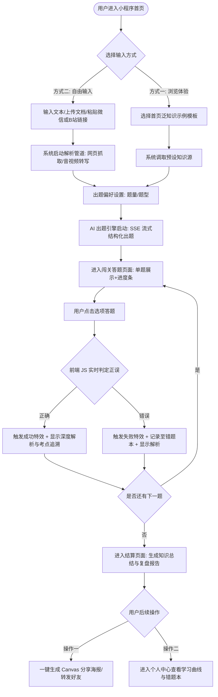

# 《智能微学习 AI 互动闯关小程序》需求分析文档

## 1. 需求背景

随着大语言模型（LLM）的普及，大众的学习范式正向碎片化、个性化的“微学习（Micro-learning）”转变。传统刷题软件或通用 AI 助手存在两大痛点：一是传统题库流于严肃枯燥，用户难以坚持；二是通用 AI 缺乏针对日常碎片化异构内容（如微信公众号文章、网络公开视频、本地文档）的极速转化通道。

### 1.1 产品愿景与定位

* **产品愿景：** 帮助大众更快、更轻松地内化任何知识。
* **产品定位：** 一款基于微信小程序生态的“多模态个人知识提取器与游戏化闯关微学习工具”。它不与大厂拼题库总量，而是切入高频、高黏性的泛阅读衍生市场，将用户的当下注意力转化为即时的互动反馈。

### 1.2 视觉与设计风格

* **核心基调：** 干净简洁、接地气、阅读舒适。
* **视觉风格：** 偏动漫风（二次元/轻写实）。引入卡通引导员、生动的闯关成功/失败动画，避免传统教育软件的沉闷感。

### 1.3 商业化红利与优势

* **政策红利：** 2025年末至2026年初微信全面支持 iOS 端“虚拟支付2.0”合规接入。年收入100万美元以下的中小开发者享受优惠费率（抽成降至15%），极大提升了净利润空间。
* **裂变优势：** 微信小程序免安装、即开即用，结合“复盘报告分享”功能可极大地降低用户获取成本（CAC）。

---

## 2. MVP 最小可行功能点

为了实现敏捷开发并快速验证市场，MVP 阶段仅保留最核心的闭环功能，主打“轻量级模式”，暂不下载庞大的本地模型，纯靠云端 API 支持。

### 2.1 首页与多模态内容输入

* **高频示例模板：** 提供若干趣味泛知识示例（如生活常识、趣味历史、热门书籍拆解），降低冷启动认知门槛。
* **统一输入网关：** * 支持自由输入或粘贴一句话、一段文本。
* 支持粘贴微信公众号文章链接、公开网页链接。
* 支持粘贴 B 站视频链接。
* 支持上传本地 PDF/Doc 文档及图片。

### 2.2 多源信息解析（静默执行）

* **网页/文章解析管道：** 优先自建 CDP（Headless Chrome）渲染抓取，失败时降级调用 Jina Reader API 获取规范文本。
* **视频提取机制：** 检测 B 站视频是否存在 CC/AI 字幕，存在则直接获取 `.srt` 文本；若无字幕则提取低码率音频交由语音转写 API（如讯飞听见）转化为文本。

### 2.3 交互式出题引擎

* **出题偏好设置：** 用户可选择题量（如快速测验 3 题或 5 题）和题型偏好（单选题、判断题）。
* **流式出题：** 大模型启用 **JSON Schema 强制结构化输出**，确保返回标准的 Q&A 数据对。前端采用 SSE（Server-Sent Events）协议实现亚秒级流式文本渲染，减少用户等待焦虑。

### 2.4 互动闯关答题

* **沉浸式卡片答题：** 清爽的单题卡片滑动或闯关界面，配备进度条、答对/答错音效及视觉动画反馈。
* **即时讲解：** 用户做出选择后，前端 JS 实时判定正误。无论对错，系统立刻高亮展示正确选项，并流畅渲染大模型生成的“考点追溯”与“深度解析”。

### 2.5 结算与社交裂变

* **知识总结与复盘：** 答题结束后，展示本次学习的知识结构总结、正确率、答题耗时及击败用户比例。
* **Canvas 海报生成：** 后端结合微信分享 API 生成带有小程序码的精美复盘海报，植入推荐关系链 ID 以实现病毒式裂变。

### 2.6 个人中心与基础复盘

* **基础看板：** 记录历史学过的知识、生成过的题库、历次答题胜率曲线。
* **错题归纳本：** 自动记录答错题目，支持用户随时查看和再次复习。

---

## 3. 后续扩展功能点（优先级规划）

在 MVP 获得市场验证、跑通用户闭环后，系统将按步骤规划以下亮点功能以提升技术壁垒与用户生命周期价值（LTV）。

| 优先级 | 功能模块名称 | 核心描述 | 预估技术栈 |
| --- | --- | --- | --- |
| **P0** | **商业化变现与装扮系统** | 推出 VIP 会员与代币充值体系；提供更长的文本解析额度、高级深度学习报告以及专属动漫主题皮肤/装扮切换。 | 微信虚拟支付 2.0 接口 |
| **P1** | **基于 RAG 的个性化私有知识库** | 允许考研、垂直行业备考、企业培训等用户持续上传、积累个人/企业文档。通过语义检索召回最关联的知识切片（Chunks），再交由大模型生成符合系统性框架的深度模拟试卷。 | 向量数据库（Milvus/Pinecone） |
| **P1** | **游戏化社交（多人对战 PK）** | 引入在线快速匹配机制，双方针对同一套由 AI 针对特定文章即时生成的考题进行竞速答题，实时展示对手进度，结合赛季排行榜提升日活（DAU）和次月留存。 | WebSocket 协议 |
| **P2** | **多模态 AI 智能视觉辅助** | 大模型自动判断题目是否需要视觉辅助（如英语单词、少儿科普、医学解剖），实时生成提示词并调用图像接口生成高质量插图嵌入到题干中。 | Midjourney / Midjourney API / Stable Diffusion |
| **P2** | **AI 数字人老师与多语种语音读题** | 利用 TTS 技术将题干、选项和解析转化为自然流利的多语种语音。在解析阶段，支持生成简短的 AI 数字人老师板书讲题短视频，提供沉浸式教学。 | 高级 TTS / 虚拟人生成技术 |

---

## 4. 用户操作流程图 (MVP 阶段)

---

## 5. 需求功能核对清单 (Task List)

### 2.1 首页与内容输入

* [ ] 首页热门泛知识示例模板展示与冷启动数据配置
* [ ] 统一输入框组件开发（支持长文本粘贴）
* [ ] 外部链接解析输入组件（公众号链接、视频链接）
* [ ] 本地文件上传网关开发（支持 PDF、Doc、常见图片格式）

### 2.2 基础解析管道 (Backend)

* [ ] 微信公众号多级解析引擎（Headless Chrome CDP -> Jina Reader API 降级方案）
* [ ] B 站视频双轨提取机制（CC 字幕抓取 -> 低码率音频缓存与转写方案）

### 2.3 AI 出题引擎

* [ ] 题量与题型偏好配置的前后端接口设计
* [ ] 大模型调用端 JSON Schema 强结构化输出配置（确保返回标准的 Q&A 对）
* [ ] 基于 SSE 协议的流式文本渲染接口

### 2.4 互动答题模块 (Frontend)

* [ ] 动漫风格清爽单题卡片滑动/闯关界面设计
* [ ] 进度条组件、答对/答错音效及视觉动画特效实现
* [ ] 选项实时正误判定逻辑及“考点追溯与解析”流畅渲染组件

### 2.5 结算与社交裂变

* [ ] 答题通关后的知识结构提炼、吸收率及击败比例算法编写
* [ ] Canvas 后端海报生成引擎（融合小程序码与用户头像）
* [ ] 微信原生分享接口（`onShareAppMessage`）及带有推荐人 ID 的关系链植入

### 2.6 个人中心与复盘

* [ ] 历史学习记录表与错题映射表的数据库设计
* [ ] 个人中心答题胜率曲线及历史题库回顾界面
* [ ] 错题归纳本查看与再次复习的基础逻辑编写

### 2.7 资质与合规准备 (上线前提)

* [ ] 小微企业或个体工商户主体注册与小程序资质绑定
* [ ] 满足受益所有人（UBO）信息登记及合规审核（满足股权/控制权要求）
* [ ] 微信商户号申请、场景绑定与微信小程序“虚拟支付2.0”合规渠道签约